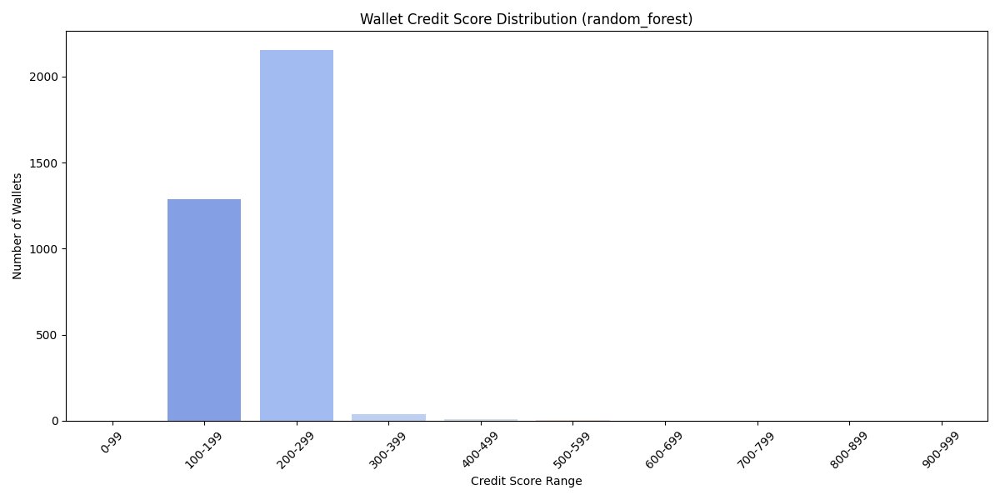
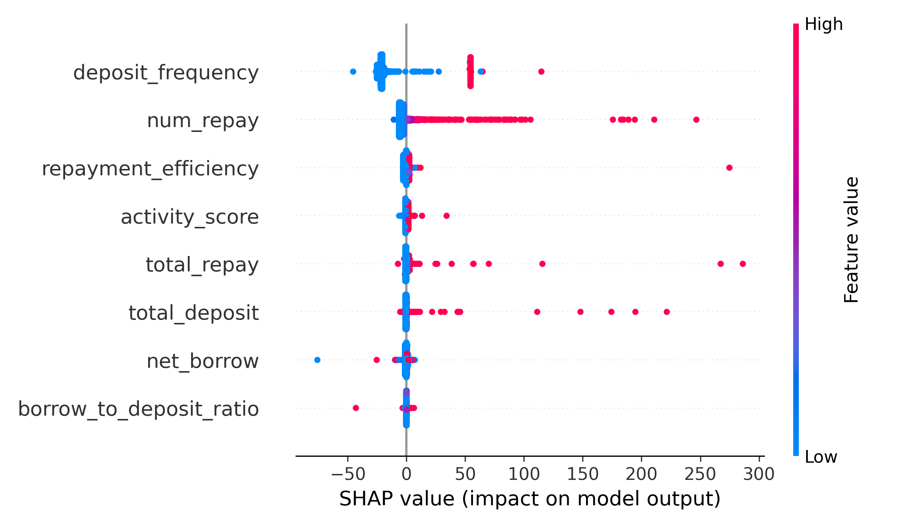

# 📈 Analysis of Generated Credit Score

---
## 📊 Analysis Random Forest Model

- **Distribution by Random Forest**:
  
    

- **SHAP Feature Importance by Random Forest**:
      
    
    

---
- **🔻 Behavior of Low-Score Wallets (<300)**:

| Feature Name             | Mean             | Std Dev          |
|--------------------------|------------------|------------------|
| num_borrow               | 3.80             | 9.97             |
| num_deposit              | 8.99             | 22.32            |
| num_redeemunderlying     | 8.50             | 244.16           |
| num_repay                | 2.44             | 6.84             |
| total_borrow             | 1.51e+16         | 2.01e+17         |
| total_deposit            | 4.14e+16         | 4.31e+17         |
| total_redeemunderlying   | 3.32e+16         | 4.41e+17         |
| total_repay              | 9.40e+15         | 1.39e+17         |
| avg_tx_gap_sec           | 2.11e+05         | 5.17e+05         |
| total_transactions       | 23.80            | 247.74           |
| activity_score           | 0.36             | 0.79             |
| net_borrow               | 5.67e+15         | 1.52e+17         |
| borrow_to_deposit_ratio  | 9.25e+14         | 4.98e+16         |
| deposit_frequency        | 0.31             | 0.46             |
| repay_frequency          | 0.06             | 0.10             |
| repayment_efficiency     | 2.39e+08         | 1.40e+10         |
| avg_repay_per_tx         | 1.07e+15         | 2.59e+16         |
| predicted_credit_score   | 230.53           | 42.22            |

**🔺 Behavior of High-Score Wallets (≥700)**:
| Feature Name             | Mean     | Std Dev  |
|--------------------------|----------|----------|
| num_borrow               | 3.20e+01 | 1.84e+01 |
| num_deposit              | 4.25e+01 | 2.33e+01 |
| num_redeemunderlying     | 2.60e+01 | 1.56e+01 |
| num_repay                | 1.70e+01 | 5.66e+00 |
| total_borrow             | 3.47e+19 | 4.41e+17 |
| total_deposit            | 5.08e+19 | 1.39e+19 |
| total_redeemunderlying   | 5.07e+19 | 1.40e+19 |
| total_repay              | 3.47e+19 | 4.86e+17 |
| avg_tx_gap_sec           | 8.28e+03 | 6.91e+03 |
| total_transactions       | 1.18e+02 | 6.29e+01 |
| activity_score           | 2.00e-02 | 1.00e-02 |
| net_borrow               | 6.97e+16 | 4.51e+16 |
| borrow_to_deposit_ratio  | 7.10e-01 | 1.90e-01 |
| deposit_frequency        | 1.00e-02 | 0.00e+00 |
| repay_frequency          | 1.50e-01 | 3.00e-02 |
| repayment_efficiency     | 1.00e+00 | 0.00e+00 |
| avg_repay_per_tx         | 2.02e+18 | 6.09e+17 |
| predicted_credit_score   | 9.53e+02 | 6.63e+01 |

---
## 📊 Analysis XGBoost Model

- **Distribution by XGBoost**:
        
    

- **SHAP Feature Importance by XGBoost**:
        
    
---
**🔻 Behavior of Low-Score Wallets (<300)**:
| Feature Name             | Mean     | Std Dev  |
|--------------------------|----------|----------|
| num_borrow               | 4.55e+00 | 9.55e+00 |
| num_deposit              | 1.09e+01 | 2.23e+01 |
| num_redeemunderlying     | 1.15e+01 | 2.95e+02 |
| num_repay                | 2.65e+00 | 5.23e+00 |
| total_borrow             | 1.11e+16 | 1.18e+17 |
| total_deposit            | 3.35e+16 | 2.35e+17 |
| total_redeemunderlying   | 3.05e+16 | 3.39e+17 |
| total_repay              | 8.22e+15 | 1.40e+17 |
| avg_tx_gap_sec           | 3.08e+05 | 6.01e+05 |
| total_transactions       | 2.96e+01 | 2.97e+02 |
| activity_score           | 7.00e-02 | 7.70e-01 |
| net_borrow               | 2.86e+15 | 1.01e+17 |
| borrow_to_deposit_ratio  | 1.35e+15 | 6.02e+16 |
| deposit_frequency        | 0.00e+00 | 2.00e-02 |
| repay_frequency          | 8.00e-02 | 1.00e-01 |
| repayment_efficiency     | 3.50e+08 | 1.70e+10 |
| avg_repay_per_tx         | 1.33e+15 | 3.11e+16 |
| predicted_credit_score   | 2.63e+02 | 8.67e+00 |

**🔺 Behavior of High-Score Wallets (≥700)**:
| Feature Name             | Mean     | Std Dev  |
|--------------------------|----------|----------|
| num_borrow               | 2.13e+01 | 2.26e+01 |
| num_deposit              | 2.83e+01 | 2.96e+01 |
| num_redeemunderlying     | 1.77e+01 | 1.82e+01 |
| num_repay                | 1.17e+01 | 1.01e+01 |
| total_borrow             | 2.32e+19 | 2.01e+19 |
| total_deposit            | 3.38e+19 | 3.09e+19 |
| total_redeemunderlying   | 3.38e+19 | 3.09e+19 |
| total_repay              | 2.31e+19 | 2.00e+19 |
| avg_tx_gap_sec           | 5.52e+03 | 6.84e+03 |
| total_transactions       | 7.90e+01 | 8.02e+01 |
| activity_score           | 6.80e-01 | 1.14e+00 |
| net_borrow               | 4.39e+16 | 5.49e+16 |
| borrow_to_deposit_ratio  | 4.70e-01 | 4.30e-01 |
| deposit_frequency        | 0.00e+00 | 0.00e+00 |
| repay_frequency          | 2.10e-01 | 1.10e-01 |
| repayment_efficiency     | 2.60e+15 | 4.50e+15 |
| avg_repay_per_tx         | 1.35e+18 | 1.24e+18 |
| predicted_credit_score   | 8.84e+02 | 1.30e+02 |
---
